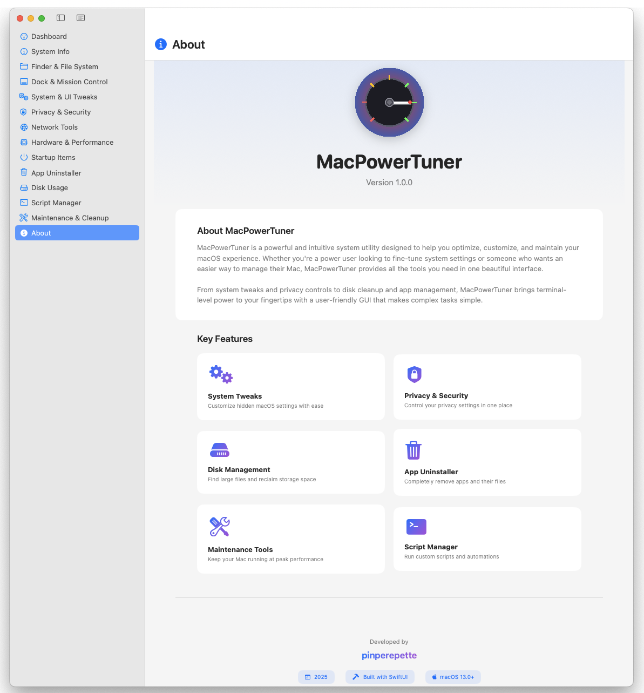

# MacPowerTuner

<div align="center">



**A powerful and intuitive macOS system utility that brings terminal-level control to your fingertips**

[](https://www.apple.com/macos/)
[](https://swift.org/)
[](https://developer.apple.com/xcode/swiftui/)
[](LICENSE)

[Download](#-download) • [Features](#-features) • [Installation](#-installation) • [Usage](#-usage)

</div>

---

## About

MacPowerTuner is a comprehensive system utility designed to help you optimize, customize, and maintain your macOS experience. Whether you're a power user looking to fine-tune system settings or someone who wants an easier way to manage their Mac, MacPowerTuner provides all the tools you need in one beautiful, modern interface.

From system tweaks and privacy controls to disk cleanup and app management, MacPowerTuner brings the power of the terminal to a user-friendly GUI, making complex tasks simple and accessible.

## ✨ Features

### 🎛️ System Management
- **Dashboard** - Real-time system monitoring with CPU, memory, and disk usage statistics
- **System Info** - Detailed hardware and software information with export capabilities
- **System Tweaks** - Customize hidden macOS settings and UI preferences
- **Finder & File System** - Advanced Finder customization and file system options
- **Dock & Mission Control** - Dock animations, auto-hide settings, and window management

### 🔒 Privacy & Security
- **Privacy Controls** - Manage system privacy settings in one place
- **Security Tools** - Configure Gatekeeper and other security features
- **Permissions Management** - Quick access to system privacy settings

### 🗂️ Storage & Apps
- **Disk Usage Analyzer** - Find large files (>100MB) and analyze folder sizes
- **App Uninstaller** - Completely remove apps and all their related files (preferences, caches, logs)
- **Startup Items Manager** - Control login items, launch agents, and launch daemons

### 🛠️ Utilities
- **Network Tools** - View local/public IP, monitor connections, ping utility
- **Hardware & Performance** - Battery info, process manager, memory purge, sleep prevention
- **Script Manager** - Create, save, and run custom shell scripts with logging
- **Maintenance & Cleanup** - Clean caches, rebuild databases, optimize system performance

### 📊 Advanced Features
- **Activity Log** - Track all system changes and operations with timestamps
- **Asynchronous Operations** - Non-blocking UI for smooth, responsive experience
- **Real-time Updates** - Live system statistics refresh every 5 seconds
- **Search & Filter** - Quickly find apps, files, and settings
- **Professional UI** - Modern SwiftUI interface with dark mode support

## 📥 Download

### Latest Release

Download the latest version of MacPowerTuner:

**[Download MacPowerTuner.dmg](../../releases/latest)**

### System Requirements

- macOS 13.0 (Ventura) or later
- Apple Silicon (M1/M2/M3/M4) or Intel processor
- 100 MB free disk space

## 🚀 Installation

1. Download the latest `MacPowerTuner.dmg` from the [releases page](../../releases)
2. Open the DMG file
3. Drag **MacPowerTuner.app** to your Applications folder
4. Launch MacPowerTuner from Applications or Spotlight
5. Grant necessary permissions when prompted (required for system modifications)

### First Launch

On first launch, macOS may show a security warning because the app is not notarized. To open:

1. Right-click (or Control-click) on MacPowerTuner.app
2. Select "Open" from the context menu
3. Click "Open" in the security dialog

### Permissions

The app will request permissions for:
- **Full Disk Access** - To scan and manage files across the system
- **Accessibility** - For certain system modifications
- **Administrator Access** - For privileged operations (when needed)

Some features require administrator privileges:
- Gatekeeper enable/disable
- DNS cache flush
- Network stack reset
- System cache cleanup
- Launch Services rebuild
- Spotlight index rebuild
- Memory purge

## 💡 Usage

### Getting Started

1. **Dashboard** - Start here to get an overview of your system status
2. **System Info** - View detailed information about your Mac and export it
3. **Explore Categories** - Use the sidebar to navigate between different tools

### Common Tasks

#### Find Large Files
1. Go to **Disk Usage** in the sidebar
2. Click **Scan for Large Files** (finds files >100MB)
3. Review the list sorted by size
4. Click "Reveal in Finder" or "Move to Trash"

#### Uninstall Apps Completely
1. Select **App Uninstaller** from sidebar
2. Choose an app from the list
3. Click **Scan for Files** to find related files in:
   - Preferences
   - Application Support
   - Caches
   - Logs
   - Saved Application State
4. Click **Uninstall** to remove the app and all related files

#### Customize System Settings
1. Navigate to **System Tweaks**, **Finder**, or **Dock**
2. Browse available options and toggles
3. Enable/disable features as desired
4. Changes are applied immediately
5. Some changes may require restarting Finder or Dock

#### Monitor and Manage Startup Items
1. Go to **Startup Items**
2. View three tabs:
   - **Login Items** - Apps that launch at login
   - **Launch Agents** - User-level background processes
   - **Launch Daemons** - System-level background processes
3. Toggle switches to enable/disable items
4. Click remove button to delete items permanently

#### Clean Up Your Mac
1. Navigate to **Maintenance & Cleanup**
2. Choose from available cleanup options:
   - User caches
   - System caches
   - Temporary files
   - DNS cache
3. Click **Clean** buttons to perform cleanup
4. Use **Rebuild** options to fix database issues

#### Run Custom Scripts
1. Go to **Script Manager**
2. Write or paste your shell script
3. Save it with a custom name
4. Run it and view output/logs
5. Scripts are saved and can be reused

## 🔧 Building from Source

### Prerequisites

- Xcode 15.0 or later
- macOS 13.0 SDK or later
- Swift 5.0 or later

### Build Instructions

```bash
# Clone the repository
git clone https://github.com/pinperepette/MacPowerTuner.git
cd MacPowerTuner

# Open in Xcode
open MacPowerTuner.xcodeproj

# Build and run (⌘R in Xcode)
# Or build from command line:
xcodebuild -project MacPowerTuner.xcodeproj -scheme MacPowerTuner -configuration Release build
```

### Project Structure

```
MacPowerTuner/
├── MacPowerTunerApp.swift              # App entry point
├── ContentView.swift                    # Main view with navigation
├── Models/
│   ├── SidebarItem.swift               # Sidebar categories enum
│   └── ActivityLog.swift               # Activity logging model
├── Views/
│   ├── DashboardView.swift             # System overview
│   ├── SystemInfoView.swift            # Hardware/software info
│   ├── FinderView.swift                # Finder customization
│   ├── DockView.swift                  # Dock settings
│   ├── SystemTweaksView.swift          # System UI tweaks
│   ├── PrivacySecurityView.swift       # Privacy & security
│   ├── NetworkToolsView.swift          # Network utilities
│   ├── HardwarePerformanceView.swift   # Hardware monitoring
│   ├── StartupItemsView.swift          # Startup management
│   ├── AppUninstallerView.swift        # App removal
│   ├── DiskUsageView.swift             # Disk analysis
│   ├── ScriptManagerView.swift         # Script editor/runner
│   ├── MaintenanceView.swift           # System maintenance
│   └── AboutView.swift                 # About the app
└── Utilities/
    ├── CommandExecutor.swift           # Command execution
    ├── AuthorizationManager.swift      # Sudo handling
    └── NotificationManager.swift       # User notifications
```

## ⚠️ Important Notes

- **Backup Your Data** - Always backup important data before making system modifications
- **Understand Changes** - Make sure you understand what each feature does before using it
- **Administrator Access** - Some features require administrator privileges
- **Use at Your Own Risk** - While MacPowerTuner is designed to be safe, system modifications can have unintended consequences
- **Gatekeeper Warning** - Disabling Gatekeeper reduces system security
- **Process Management** - Killing processes can cause data loss or system instability
- **Cache Cleanup** - Cleaning caches may temporarily slow down applications
- **Test First** - Try features on non-critical systems first

## 🤝 Contributing

Contributions are welcome! Please feel free to submit a Pull Request. For major changes, please open an issue first to discuss what you would like to change.

### How to Contribute

1. Fork the repository
2. Create your feature branch (`git checkout -b feature/AmazingFeature`)
3. Commit your changes (`git commit -m 'Add some AmazingFeature'`)
4. Push to the branch (`git push origin feature/AmazingFeature`)
5. Open a Pull Request

## 📝 License

This project is licensed under the MIT License - see the [LICENSE](LICENSE) file for details.

## 👨‍💻 Developer

**Pinperepette**

- GitHub: [@pinperepette](https://github.com/pinperepette)
- X: [@pinperepette](https://x.com/Pinperepette))

## 🙏 Acknowledgments

- Built with [SwiftUI](https://developer.apple.com/xcode/swiftui/) framework
- Icons from [SF Symbols](https://developer.apple.com/sf-symbols/)
- Inspired by various macOS utilities and power user tools
- Community feedback and contributions

## 📮 Support

If you encounter any issues or have suggestions:

1. Check existing [Issues](../../issues) to see if it's already reported
2. Create a new issue with:
   - Detailed description of the problem
   - Steps to reproduce
   - Your macOS version
   - Screenshots if applicable
3. For questions, use [Discussions](../../discussions)

## 🗺️ Roadmap

Future features under consideration:

- [ ] Batch operations for app uninstaller
- [ ] Custom themes and color schemes
- [ ] Export/import settings profiles
- [ ] Scheduled maintenance tasks
- [ ] Menu bar app mode
- [ ] Quick actions with keyboard shortcuts
- [ ] Backup manager integration
- [ ] Additional system tweaks
- [ ] Performance benchmarking tools

## 🔄 Changelog

See [CHANGELOG.md](CHANGELOG.md) for a list of changes in each version.

---

<div align="center">

**Made with ❤️ for macOS power users**

If you find MacPowerTuner useful, please consider giving it a ⭐ on GitHub!

</div>
